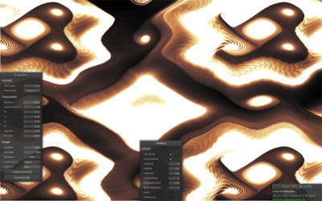

# gpufrac
A GPU based fractal generator (CUDA, OpenGL) mostly featuring orbit-spaced fractals like the Popcorn fractal by Clifford A. Pickover.

# 
- adjust parameters of fractals in realtime
- advanced coloring
- some fractals also support animation
